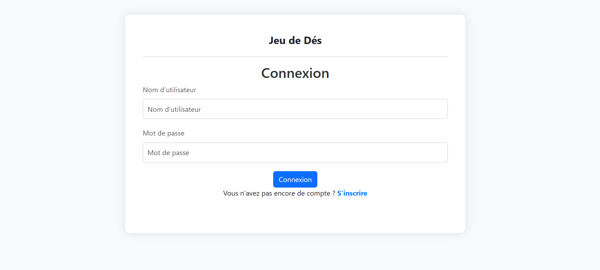

# Rice Game Web Application

## Table of Contents

1. [Overview](#overview)
2. [Features](#features)
3. [Technologies Used](#technologies-used)
4. [Installation](#installation)
5. [Usage](#usage)
6. [Contributors](#contributors)

## Overview

This web application is a simple game developed using Java Enterprise Edition (JEE) components such as filters, servlets, and JavaServer Pages (JSP). The backend is implemented using JEE, while Bootstrap is used for the frontend.

## Features

- User authentication: Users can create accounts and log in to access the game.
- Playg: Users can Play and access to their score.
- Database selection: Users have the option to use either MySQL database or the application context for data storage.

## Technologies Used

- Java
- Java Enterprise Edition (JEE)
- Servlets
- JavaServer Pages (JSP)
- Bootstrap
- MySQL
- Apache Tomcat (v10.1.18)

## Installation

1. Clone the repository: `git clone https://github.com/aymane-maghouti/Rice-Game`
2. Set up Apache Tomcat (10.1.18) and MySQL server.
3. Import the project into your preferred IDE.
4. create the gamedb database or use the application context for data storage.(you can make your choice via the web.xml file)
5. Deploy the application to Apache Tomcat.

## Usage

1. Start Apache Tomcat server.
2. Access the application through your web browser.
3. Register for an account or log in if you already have one.
4. Start playing the Rice Game by buying and selling rice.
5. Enjoy the game!

### User Interfaces:

- Log in Interface :

 

 - Register Interface :

  

  - Home Interface :

  

  - Rules Game :

  

## Contributors

- **Names:** Aymane Maghouti, Ossama Outmani
- **LinkedIn:** <a href="https://www.linkedin.com/in/aymane-maghouti/" target="_blank">Aymane Maghouti</a> , <a href="https://www.linkedin.com/in/ossama-outmani" target="_blank">Ossama Outmani</a>  

